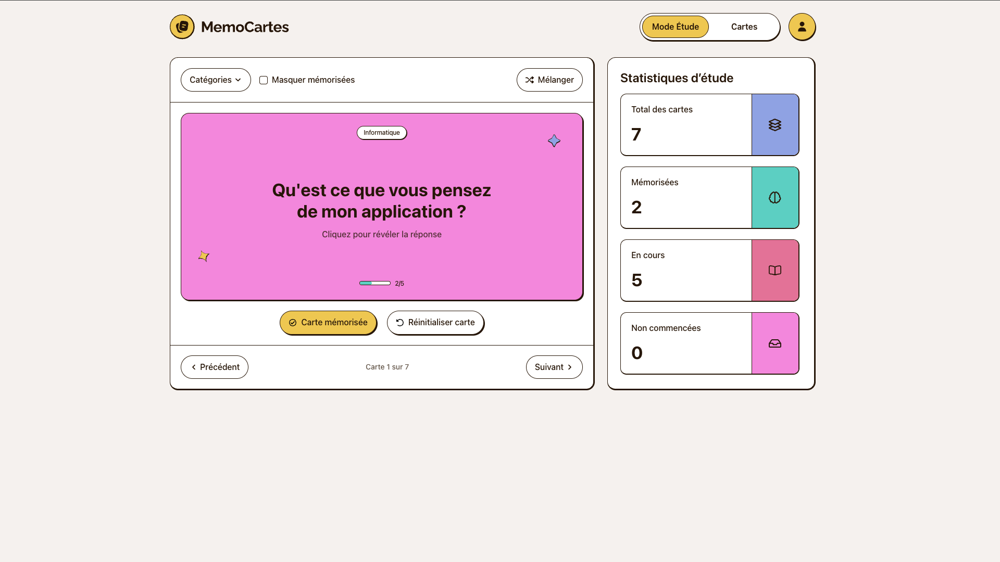
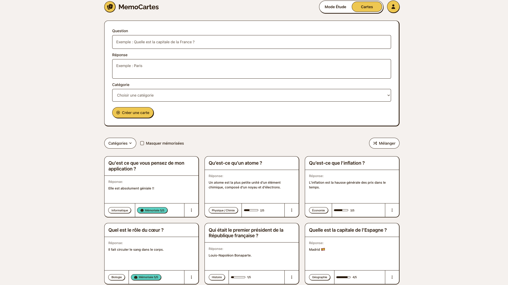

# MemoCartes

## Stack

     

## Présentation

Application web de flashcards de mémorisation et de révision. Créez, organisez et mémorisez vos cartes de connaissances et suivez votre progression.

## Aperçu

### Mode Étude

### Gestion des cartes

## Déploiement

Application sur **Vercel**, base de données **PostgreSQL** sur **Neon**

## Technologies

**Frontend** : Next.js 16, React 19, TypeScript, Tailwind CSS 4

**Gestion d'état** : Zustand

**Validation** : React Hook Form, Zod

**Animation** : Motion, Lottie React

**Authentification** : Better Auth (Google OAuth, email/password)

**Backend** : Next.js API Routes, PostgreSQL (Neon)

## Fonctionnalités

## Fonctionnalités

L'application comprend deux pages principales :

**Mode Étude** : Interface de révision avec carte question/réponse à effet flip. Boutons pour incrémenter la maîtrise (+1 niveau jusqu'à 5/5) ou réinitialiser à 0/5. Navigation entre cartes (Précédent/Suivant), mélange aléatoire et filtres (par catégorie, masquage des cartes mémorisées). Panneau statistiques affichant le total, les cartes mémorisées, en cours et non commencées.

**Gestion des cartes** : Formulaire de création (question, réponse, catégorie). Grille de cartes avec système CRUD (édition et suppression via menu contextuel). Filtres par catégorie et masquage des mémorisées. Pagination par lots de 12 cartes.

**Authentification** : Google OAuth et email/password avec Better Auth. Protection des routes et redirection automatique.

